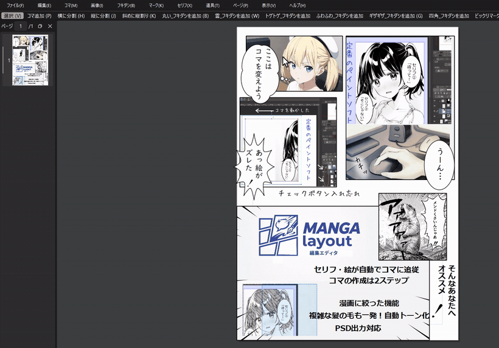
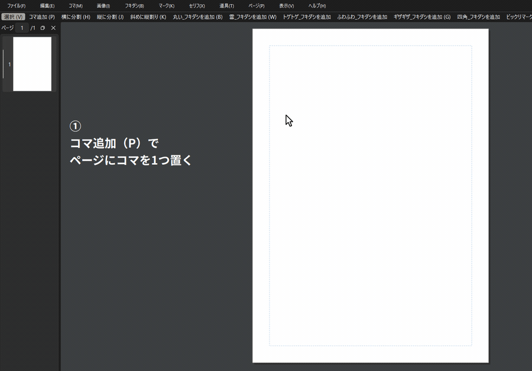
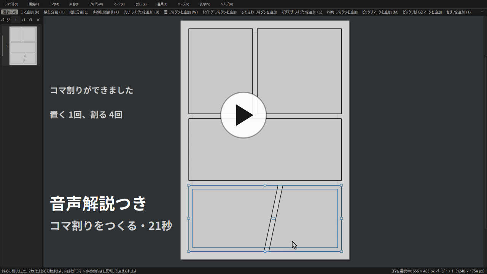
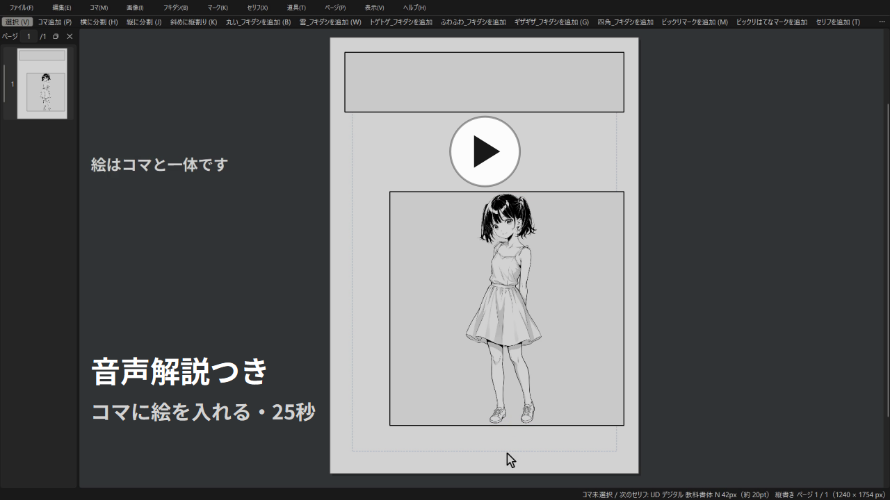
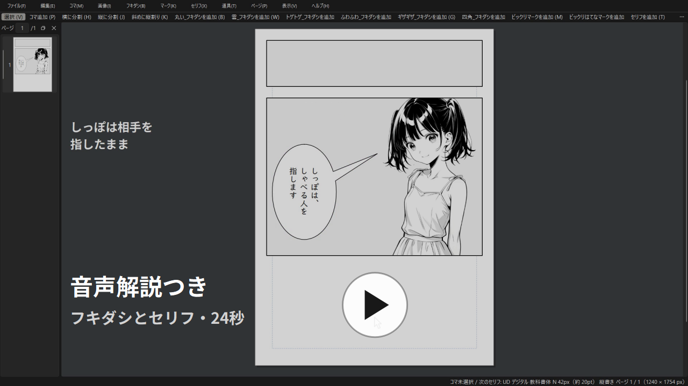

# MANGA_layout（漫画レイアウタ）

**漫画制作支援エディタ**  
ペイントソフト や 生成AI で描いた画像を読み込み、**コマ割り・フキダシ・セリフ配置**を行うためのエディタです。

用途は**ネーム／下書き**を想定で、清書・仕上げはペイントソフト側で行う。決まったレイアウトを画像で書き出し、
作画の下敷きにするところまでを受け持つ。

- ウェブ漫画用で、印刷は考慮していません。単位は**ピクセル（px）**で、dpi の指定はしない。
- できないこと: ブラシ / 消しゴム / レイヤー効果 / **PSD の読み込み** / AI 生成 / ベクター / フィルター / 色調補正 / 印刷入稿品質の出力など
  （**PSD の書き出しはできます** → 下記「クリスタへレイヤーごと渡す」）
- **トーンは「貼る」のではなく「置き換える」だけ**できます。絵の黒ベタを斜線・灰色・白に
  変えられますが、好きな場所を選んでトーンを塗る道具はありません（→ 下記「黒ベタをトーンにする」）。
  **クリスタのトーンを貼りたいときは、PSD で4枚に分けて渡せます**（絵・白ベタ・トーン範囲・
  トーンに分かれるので、トーンを消して貼り替えるだけで済みます → 下記「クリスタのトーンを
  貼りたいとき」）



---

## 入手する

**[Releases](../../releases) から最新版の zip をダウンロードし、好きな場所に展開してください。**

Releases に並んでいるものが、動作を確認済みの安定版です。ページ上部に見えているファイル一覧
（`main` ブランチ）は開発中の状態で、実験中の機能が入っていることがあります。**使う目的なら
Releases から取ってください。**

## はじめて使うとき

**先に Python 3.12 が入っている必要があります。** 入っていない場合は
[python.org](https://www.python.org/downloads/) から入れてください。

そのうえで `_setup_env.bat` をダブルクリックします。動かすのに必要なものが入ります。
**最初の1回だけ**で、2回目からは不要です（もう一度実行しても壊れません）。

Python が見つからないときは、`_setup_env.bat` が黒い画面にこう出して止まります。
そのまま閉じて、上のリンクから入れ直してください。

```
ERROR: could not create the venv. Python 3.12 may be missing.
```

## 起動する

`run.bat` をダブルクリックします。

好みの設定（最初に開くフォルダなど）を変えたいときは `settings.bat` です（→ 下記「設定ファイル」）。

---

## 使い方の流れ

右クリックで状況に応じたコマンドが出る仕組みです。  なので以下の操作方法は適当に読み飛ばし可
1. `P` を押してコマを置き、`H` / `J` で分割してコマ割りを作る
2. コマをダブルクリックして中に入り、`Ctrl+V` で画像を貼る（`Ctrl+Shift+F` でコマいっぱいに広げる）
3. `B` / `W` / `G` でフキダシ、`T` でセリフを置く。`F2` で文字を打つ
4. `Ctrl+Shift+N` でページを足し、`PageUp` / `PageDown` で行き来する
5. `Ctrl+S` で保存し、`Ctrl+E` で画像に書き出す
  
## あの機能がどこにあるか分からないとき

**メニューの ヘルプ → メニューを探す...**（`F1` または `Ctrl+F`）で、言葉を打ち込むと、
それを含む項目が**どのメニューの中にあるか**と一緒に並びます。

```
ファイル → ラフ → 読み込む...
　紙に描いたラフを、このページの一番下に敷く（書き出しには出ない）
```

- **項目の名前だけでなく、説明の文も探します。** 「backup」で「バックアップから復元...」が出ます
- **行を押すと、そのメニュー（この例なら「ファイル」）が画面の上端で四角く囲まれます。** 3秒で消えます
- **ここから実行はしません。** 最初に開く場所を指すだけなので、あとはメニューを開いてください
- **何も打たなければ全部並びます。** メニューの一覧としても使えます
- **フキダシは「吹き出し」「吹きだし」「ふきだし」でも出ます。** それ以外の言葉は打った通りに探すので、出てこなかったら言ってください（読み替えを足せます）

## キーを忘れたとき

**メニューの ヘルプ → ショートカットキーの一覧...** で、キーでできる操作が
メニューごとに並びます。

**同じ内容を [docs/ショートカットキー一覧.md](docs/ショートカットキー一覧.md) にも
置いています。** アプリを開かずに読めます。下の「ショートカット」はよく使うものの
抜粋で、**全部載っているのはそちらです。**

```
■ セリフ
  F2         文字を入力...
  Ctrl+>     大きく
```

- **メニューに出ないキーとマウスの操作も、いちばん下に付きます。** `+` / `-`、スペース+ドラッグ、ホイールなど
- **出したままで押して試せます。** 窓を閉じなくても作品の側を操作できます
- **セリフを打っている間は、文字の入力が優先されます。** 打ち込んだキーが操作に化けることはありません

## 書き出す前に「抜けチェック」

**メニューの ファイル → 抜けチェック...** で、全ページの直し忘れを探します。
**勝手に直すことはありません。** 見つけて知らせるだけで、直すかどうかはご自身で決めます。

探すのは6つ。

| 探すもの | 中身 |
|---|---|
| 使えない画像 | 画像ファイルが無いか、壊れていて開けません。書き出すと、そこが白く抜けます |
| 何も置いていないページ | コマもフキダシも無いページ。書き出すと白いページが出ます |
| フキダシからはみ出したセリフ | 字がフキダシの外へ出ています |
| 空のままのセリフ | 文字を打ち忘れたセリフ |
| 絵の入っていないコマ | 絵をまだ貼っていないコマ |
| 付箋の残っているページ | 消し忘れた付箋（→ 一覧の右クリックで貼るもの） |

**用紙からはみ出したコマは探しません。** 紙の端まで絵を出すのは普通の使い方なので、
探すと毎回引っかかって読む気がなくなるためです。

**ラフ（下敷き）を敷いただけのページは「何も置いていないページ」になります。**
ラフは書き出されないので、そのまま書き出すと白いページが出るためです。

結果は2か所に出ます。

- **窓に文で** — 「どの種類が何件、何ページ目に」が並びます。閉じるまで消えないので読み返せます。選んでコピーもできます
- **ページ一覧に紫の印** — 見つかったページのサムネイルの**左上**に付きます。**押せばそのページへ移れます**

紫の印は**窓を閉じたあとも残ります**。直しながら残りを追うためのものです。**もう一度「抜けチェック」を押すと数え直して付け直す**ので、直したページの印は消えます。

**この印は作品には保存されません。** 付箋（黄・桃・青）とは別物で、貼ってある付箋を消したりもしません。アプリを閉じるか別の作品を開くと消えます。

## 黒ベタをトーンにする


**絵の黒く塗ってある所を、斜線のトーンに変えられます。** 元の画像は変わりません。

1. コマ（または中の絵）を選ぶ
2. **右クリック → トーン → 入れる**（メニューの **画像 → トーン** からも同じものが出ます）

コマに絵が2枚以上あるときだけ、どちらに掛けるか決まりません。その場合は
**ダブルクリックで絵を選んでから**入れてください。

濃さ・斜線の細かさ・向きは、同じメニューから押して変えます。

### 3つの見た目から選べます

同じメニューの **斜線 / 灰色 / 白抜き** で切り替えます。今どれかはレ点で分かります。
**どこを置き換えるか（拾う黒・細い線・範囲）は3つとも同じ**で、置き換えた先の見た目だけが
変わります。

| 種類 | 見え方 | 使いどころ |
|---|---|---|
| **斜線**（最初はこれ） | 白地に黒い斜線 | ネームの段階で「ここはトーン」と読める |
| **灰色** | むらの無い灰色 | 斜線がうるさいとき。**濃さは「濃く」「薄く」でそのまま変えられます** |
| **白抜き** | 白く抜ける | ネームの段階でトーンを主張させたくないとき。**クリスタで貼り直す前提なら、消した後の見た目もこれで揃います**（→ 下記「PSD で書き出し」） |

**灰色と白抜きでは、効かない項目がグレーになります**（灰色では斜線の細かさと向き、
白抜きではさらに濃さ）。値は消えていないので、**斜線に戻せば前の調整がそのまま返ります**。

**調整する項目は、何回でも重ねて押せます。** 項目名の後ろに出る「細い線を残す（2/20）」の
数字が、今どこまで動かしたか（全部で20段のうち2段目）です。押すたびに増えるので、
**効きが足りなければ、変わるまで押し続けてください**。1回で決めるものではありません。

**うまくいかないときは、次の2つを動かします。**

| 症状 | 押す項目 |
|---|---|
| 黒ベタなのにトーンにならない | **`Shift`+`]`**（「拾う黒を増やす」）。JPG や AI で描いた絵は、黒が少し薄くなっていることがあります |
| 拾いすぎて余計な所まで斜線になった | **`Shift`+`[`**（「拾う黒を減らす」） |
| 線画の線まで斜線になって、絵が壊れた | 「細い線を残す」。押すほど、細いものはトーンにしなくなります（3回ほど重ねてちょうどよくなることもあります） |

**拾う黒はキーで連打できます。** 絵ごとにちょうどいい所が違うので、`Shift`+`]` と `Shift`+`[` を
押し比べて合わせてください。何回押しても、元に戻すは1回で済みます。

**それでも余計な所（服の模様・目の黒など）が拾われるとき**は、範囲を四角で囲えます。
同じメニューの **トーン範囲を調整** を押すと、絵の上に水色の枠が出ます。そのまま
ドラッグで囲い直し、四隅の **×** を引くと大きさを変えられます。囲った外は黒いまま残ります。

元に戻すときは、すぐ下の **範囲を全体に戻す**。

**調整をやめるときは、同じ項目（トーン範囲を調整）をもう一度押します。** レ点が外れて、
普段の選択に戻ります。調整している間は、**メニューの「トーン」が「トーン調整中」に変わり**、
画面の右下にも「トーン範囲を調整中」と出ます。

**別のコマのトーンを触るときは、先に選び直します。** この道具を持っている間は、
クリックしても選ぶものは変わりません（囲う操作が優先されます）。**トーン範囲を調整** を
もう一度押して調整をやめ、そのコマを選んでから、また押してください。
**選んでいる絵から外れた場所を囲おうとしても、何も起きません**（画面下に理由が出ます）。

## 絵の一部を消す（切り抜き）

**背景だけ消す、人物だけ残す、といった切り抜きができます。** 元の画像は変わりません。
消した所は、いつでも元に戻せます。

1. メニューの **画像 → 切り抜き** を押して、道具に持ち替える（**絵は選んでおかなくて構いません**。押した所の絵が対象になります）
2. 消したい所を**クリック**する。押した1点から、似た濃さの続く範囲が広がって消えます
3. 違ったら **元に戻す（`Ctrl+Z`）**。続けて押せば、区画をいくつでも消せます

**`Shift` を押しながらクリックすると、逆に「そこだけ残す」。** 背景が線でいくつにも
割れている絵では、消す側を何度も押すより速く済みます。

**線で囲まれた絵が得意です。** 線画やべた塗りのように、地が一様で線が閉じている絵では、
囲まれた1区画がそのまま取れます。逆に、**グラデーションで塗った絵は苦手です。**
線に1画素でも隙間があると、そこから外へつながって、思ったより広く消えます。

**消えすぎた／足りないときは、許容差を動かします。** 同じメニューの
**許容差を広く / 許容差を狭く** で、「似ている」と見なす濃さの幅が変わります。

| 症状 | 押す項目 |
|---|---|
| 押しても少ししか消えない | **許容差を広く**。広げるほど、隣の区画までつながります。JPG や AI で描いた絵は、白地が少し汚れていることがあります |
| 絵の半分が消えてしまった | **許容差を狭く**。狭めるほど細かく割れます。それでも収まらない絵は、この道具には向きません |

画面のほとんどが消えたときは、**「線に隙間があるかもしれません」**と画面の下に出ます。
そのまま進めても構いません（元に戻すで1回で戻ります）。

**消した結果は作品に保存され、書き出しにもそのまま出ます**（PNG・JPG と、PSD の
「絵」レイヤー・トーンの3枚。→ 下記「PSD で書き出し」）。

**元の絵に戻すときは、同じメニューの 切り抜きを外す。** 消した所が全部戻ります。

**道具をやめるときは、メニューの「切り抜き」をもう一度押します。** 持っている間は、
クリックしても選ぶものが変わりません（消す操作が優先されます）。持っている間は画面の
右下に「切り抜き中」と、今の許容差と、やめ方が出ています。

## クリスタへレイヤーごと渡す（PSD で書き出し）

**書き出しの形式で `PSD` を選ぶと、1枚に潰さずレイヤーに分けて書き出せます。**
クリスタで開いたとき、コマ枠だけ残す・絵だけ薄くする・セリフを消して打ち直す、が
できるようになります。

押すものは PNG のときと同じ（`Ctrl+E` → 形式で `PSD` を選ぶ）です。範囲や大きさの
選び方も変わりません。

**コマは1つずつフォルダに入ります。** 置いていないものは入りません（フキダシを
使っていないページに、空の「フキダシ」は出てきません）。

| 上から | 中身 |
|---|---|
| セリフ | 文字。**クリスタでは打ち直しになります**（文字としては編集できません） |
| マーク | 「！」「!?」 |
| フキダシ | しっぽも含めて |
| **📁 コマ1** | コマ枠 / 集中線・流線 / **トーン・トーン範囲・白ベタ**（→ 下）/ 絵 |
| **📁 コマ2** | ↑ と同じ中身。コマの数だけ並びます |
| ラフ | **最初は非表示**。クリスタ側で表示に切り替えると出ます |
| 用紙 | 白 |

**コマは読む順**（上から下・右から左）に番号が振られ、その順で並びます。
フォルダは閉じた状態で入るので、必要なものだけ開いてください。

**この番号は、`N`（次のコマを提案）が数える順とは違うことがあります。** どちらも
上から下・右から左ですが、**段の区切り方が違います**。段の高さが揃わないページと、
4コマ2列のページで食い違います。**番号はただの名前で、中身は入れ替わりません。**

ただし**コマを重ねて置いたページでは、重なり順のまま並びます**（番号は読む順のまま）。
並び順が絵の重なりそのものなので、そちらを優先します。

### クリスタのトーンを貼りたいとき（トーンは4枚に分かれています）

**クリスタのトーンは種類がずっと多い**ので、こだわるなら結局そちらで貼り直すことに
なります。そのために、**トーンを入れたコマは4枚に分けて**書き出します。

| 上から | 中身 |
|---|---|
| **トーン** | MANGA_layout が作ったトーン。**これを消して、自分のトーンに差し替えます** |
| **トーン範囲** | 最初は非表示。**選択範囲を作るための目印** |
| **白ベタ** | 元の絵の黒ベタを隠す白 |
| **絵** | **トーンが焼き込まれていない、元のままの絵** |

貼り直す手順はこれだけです。

1. **トーン** のレイヤーを消す（または非表示にする）
2. **トーン範囲** を選び、**レイヤーから選択範囲**（「レイヤー」メニュー → 「選択範囲」）を作る
3. その選択範囲のまま、好きなトーンを貼る

**白ベタがあるので、元の黒ベタが下から透けてきません。** 貼ったトーンの網点の隙間から
下の絵が見えて濃くなる、ということが起きません。

トーン範囲は**絵とぴったり同じ場所**に入るので、位置を合わせ直す必要はありません。
また**白ベタの上に置いてある**ので、それを選んだまま新しいレイヤーを作れば、白ベタより
手前・コマ枠より奥に入ります。

トーンを入れていないコマには、この3枚は出てきません。

**絵を重ねているコマだけは分かれません。** トーンを入れた絵の上にもう1枚絵を重ねている
場合だけ、これまでどおり「絵」にトーンが焼き込まれた形（＋トーン範囲）で出ます。
分けると、上に重ねた絵よりトーンが手前に出てしまうためです。

**気をつけること。**

- **ファイルはかなり重くなります。** 1ページで 20MB 前後（PNG の50〜60倍）。
  全ページ書き出すとページ数ぶん積み上がります
- **クリスタ側で上のコマの絵を非表示にすると、下のコマの枠線が出てきます。**
  重ねて隠していたものが見えるだけで、壊れているわけではありません
- **トーンを4枚に分けたページは、PNG で書き出したものとトーンの境目 1px だけ違います。**
  絵とトーンが別々に縮んでから重なるためで、面の中も外も同じです。クリスタで見える絵と
  PSD の中身は一致しています

## 出力ファイルの場所： 
書き出した画像は**作品フォルダの中の `export` フォルダ**に入ります。形式（PNG / JPG / PSD）と
大きさ（117% / 100% / 75% / 50%）は書き出しの画面で選べます。既定は PNG の 100%（原寸）で、
ページの大きさそのままの画素数で出ます。クリスタの原稿に貼る下敷きをきめ細かくしたいときだけ
117% を選んでください。
PSD も同じ場所に、`p01.psd` のように拡張子だけ変えて入ります。

---

## 保存されるもの

作品は1個のファイルではなく、**フォルダ**として保存されます。中身は次の4つです。

| 名前 | 中身 |
|---|---|
| `project.json` | 作品そのもの。**開くときはこれを選ぶ** |
| `assets` | 貼り込んだ画像。名前は自動で付くので、手で触らない |
| `backup` | 自動で取られる控え。保存のたびに5世代、5分ごとに3世代 |
| `export` | 書き出した画像 |

調子が悪くなって前の状態に戻したいときは、**「ファイル」→「バックアップから復元...」**で、
`backup` に貯まった控えから1つ選びます。

- 選んでも `project.json` はまだ書き換わりません。**気に入らなければ `Ctrl+Z` で戻せます**
- 戻した状態を残すには、そのあと `Ctrl+S` で保存します
- 一覧には日時と、ページ数・コマ数が出ます（どの頃の作業かの手がかりになります）

---

## 設定ファイル

好みに合わせて変えられる項目は、**`data` フォルダの中の `settings.json`** にあります。

**`settings.bat` をダブルクリックすると、書き換えるための小さな窓が開きます。**
入れられない値はそもそも入力できず、フォルダは「選ぶ…」から選べるので、
下に書いた書き方（`\` を2つ重ねる、範囲を守る）を気にせずに済みます。
メモ帳などで直接開いて書き換えることもできます（どちらでも同じです）。

```json
{
  "format_version": 1,
  "default_parent_dir": "F:\\2025_e\\a漫画用\\帰省\\下書き",
  "autosave_interval_sec": 300,
  "jpg_quality": 90,
  "rough_opacity": 0.4
}
```

| 項目 | 既定 | 入れられる値 | 何が変わるか |
|---|---|---|---|
| `default_parent_dir` | `null` | フォルダの場所 | 保存や画像選びの画面が最初に開く場所。作品フォルダそのものではなく、その**1つ上**を指定します |
| `autosave_interval_sec` | `300`（5分） | 5〜3600（秒） | 自動で控えを取る間隔。**変えたらアプリを開き直します** |
| `jpg_quality` | `90` | 1〜100 | JPG で書き出すときの画質（→ 下記） |
| `rough_opacity` | `0.4` | 0.05〜1.0 | ラフ（下敷き）の濃さ。小さいほど薄くなります |

メモ帳などで直接書き換えるときの注意（`settings.bat` の窓から変えるなら、どれも気にしなくて構いません）。

- **フォルダの場所は `\` を2つ重ねて書きます**（`F:\\2025_e\\...`）
- 決められた範囲から外れた値を書いても、**元の値で普通に動きます**。書き間違いでアプリが開かなくなることはありません
- `autosave_interval_sec` 以外は、アプリを開いたまま書き換えてもすぐ効きます

**書き換えたのに効かないときは、`settings.bat` を開いてみてください。** 使えなかった値がある場合は、
その項目名が窓の上に出ます（ファイル全体が読めなくなっている場合も、その旨が出ます）。

### JPG の品質について

`jpg_quality` は 0〜100 で、大きいほど高画質・大容量になります。**100 にする意味はほとんどありません。**
品質ごとのデータ量の目安は次のとおりです（品質 100% のときを「1MB」とした場合）。

| 品質 | データ量 | 1MB のとき | 位置づけ |
|---|---|---|---|
| 95% | 約 50〜60% に減る | 約 550KB | 画質は 100% と**全く見分けがつかない**のに、データ量は一気に半分近くまで落ちます |
| 90%（既定） | 約 30〜40% に減る | 約 350KB | プロのカメラマンがウェブで公開する際によく使う、高画質と軽さを両立できる設定です |
| 80% | 約 20〜30% に減る | 約 250KB | 一般的なウェブサイトやブログで最も推奨される設定です。画質はきれいに保たれたまま、データ量は4分の1程度まで激減します |

**なぜ少し下げるだけでこんなに減るのか。**
JPG は「人間の目が気づきにくい細かい色の変化」から順番に、大雑把に間引いていく仕組みだからです。
品質 100% から 95% にするだけで、目には見えない不要なデータが大量に削ぎ落とされるため、
画質を落とさずにこれだけのデータ量を削減できます。

---

## ショートカット



**同じ手順を、音声の解説つきで見られます。**  
1本目が**コマ割りをつくる**（21秒）、2本目が**コマに絵を入れる**（25秒）、
3本目が**フキダシとセリフを置く**（24秒）。

<a href="https://youtu.be/jodjE9Fg_Rs"></a>
<a href="https://youtu.be/20XotHmBv9o"></a>
<a href="https://youtu.be/4wVGzPz8kPs"></a>

### 道具の切り替え

| キー | 動作 |
|---|---|
| `V` / `P` | 選択 / コマ追加 |
| `H` / `J` / `K` | 横に分割 / 縦に分割 / 斜めに縦割り |
| `B` / `W` / `G` | フキダシ（丸い / 雲 / ギザギザ）。トゲトゲ・ふわふわ・四角はメニューと右クリックから |
| `T` / `M` | セリフ / ビックリマーク。ビックリはてなはメニューと右クリックから |

### コマ・画像

| キー | 動作 |
|---|---|
| ダブルクリック | コマに入って画像を選ぶ。**もう一度押すと、同じ場所の次のものへ**（下に隠れたコマや絵を選べます） |
| `Ctrl+V` | 画像を貼り付け |
| `Ctrl+Shift+F` | 画像をコマいっぱいに広げる |
| `Ctrl+Shift+A` | ページ全面にコマを作る |
| `N` | **次のコマを提案して置く。** 押すたびに次の案へ差し替わります（下記） |
| `Delete` | 選択中のコマ・画像を削除 |
| `Esc` | 画像からコマへ戻る／選択を解除 |
| `Shift`+ドラッグ | 縦横の比を保ったまま拡大縮小／15度ずつ回転（画像のつまみ） |

**`N`（次のコマを提案）について。** 描きかけのページを見て、次に置くコマの位置と
大きさを決めて置きます。**下見ではなく、実際に置きます。** 気に入らなければ
`N` をもう一度押すと次の案に差し替わり、`Ctrl+Z` を1回押せば消えます
（何回押しても、戻すのは1回です）。
コマが1つも無いページでも押せます。斜めのコマがあるページでは断ります。

### セリフ（テキスト文字）

| キー | 動作 |
|---|---|
| `F2` / `Enter` | 選択中のセリフを打つ |
| `Ctrl+B` | 太字にする |
| `F7` | 縦書き / 横書きを切り替える |
| `Ctrl+>` / `Ctrl+<` | 大きく / 小さく |

### トーン

| キー | 動作 |
|---|---|
| `Shift+]` / `Shift+[` | 拾う黒を増やす / 減らす（トーンの入った絵かコマを選んでいるとき） |
| `Shift+.` / `Shift+,` | 濃く / 薄くする（白抜きのときは効きません） |

### ページ

| キー | 動作 |
|---|---|
| `Ctrl+Shift+N` / `Ctrl+Shift+I` | ページを追加（末尾）/ 挿入（今のページの前） |
| `PageUp` / `PageDown` | 前後のページへ |
| `Ctrl+Shift+PageUp` / `Ctrl+Shift+PageDown` | 今のページを前後へ動かす（並べ替え） |

### 画面

| キー | 動作 |
|---|---|
| ホイール | 拡大縮小（マウスの位置が中心） |
| `+` / `-` | 拡大縮小（画面の中心が軸） |
| `Ctrl+1` / `Ctrl+0` | 原寸で表示 / ページ全体を表示 |
| スペース+ドラッグ／中ボタン+ドラッグ | 画面を動かす |
| 右クリック | 押した場所のものを選び、その場のメニューを出す |

### ファイル

| キー | 動作 |
|---|---|
| `Ctrl+S` / `Ctrl+Shift+S` | 保存 / 名前を付けて保存 |
| `Ctrl+N` / `Ctrl+O` / `Ctrl+W` | 新規作成 / 開く / 閉じる |
| `Ctrl+E` | 画像で書き出し（PNG / JPG / PSD） |
| `Ctrl+Z` / `Ctrl+Y`（`Ctrl+Shift+Z`） | 元に戻す / やり直す |

### 探す

| キー | 動作 |
|---|---|
| `F1` / `Ctrl+F` | メニューを探す（→ 上記「あの機能がどこにあるか分からないとき」） |

### 全部の一覧

**上の表はよく使うものの抜粋です。** トーンの調整やマウスの操作も含めた全部は
[docs/ショートカットキー一覧.md](docs/ショートカットキー一覧.md) にあります。
**アプリのメニューから自動で作っている**ので、キーを変えても古くなりません。

---

## 仕様の詳細について

このリポジトリを読む AI・開発者は、**[要件定義.md](要件定義.md) を先に読むことを推奨します。**
機能の仕様と、なぜその形にしたかの経緯がすべてそこにあります。この README は使う人向けの説明で、
仕様の正となる文書ではありません。

---

## ライセンス

MIT ライセンスです（→ [LICENSE](LICENSE)）。**改変も再配布も自由**で、商用利用も構いません。
条件は「著作権表示とライセンス文を残すこと」だけです。無保証です。
