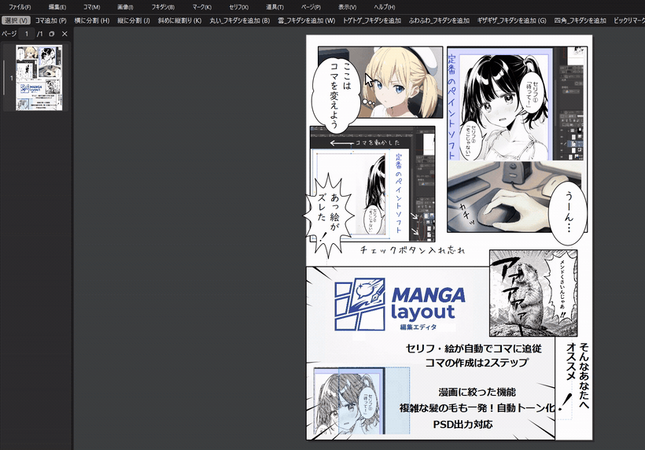
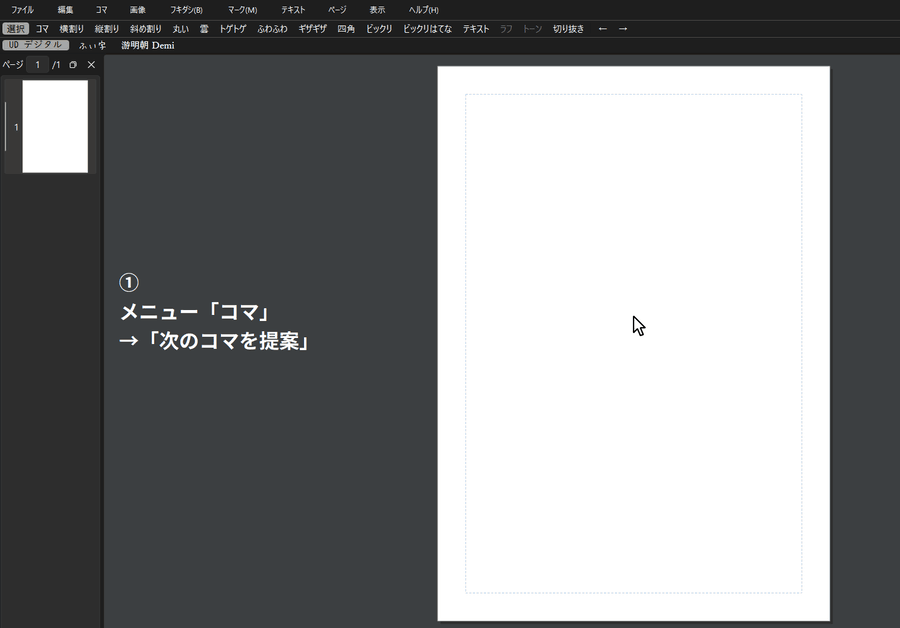
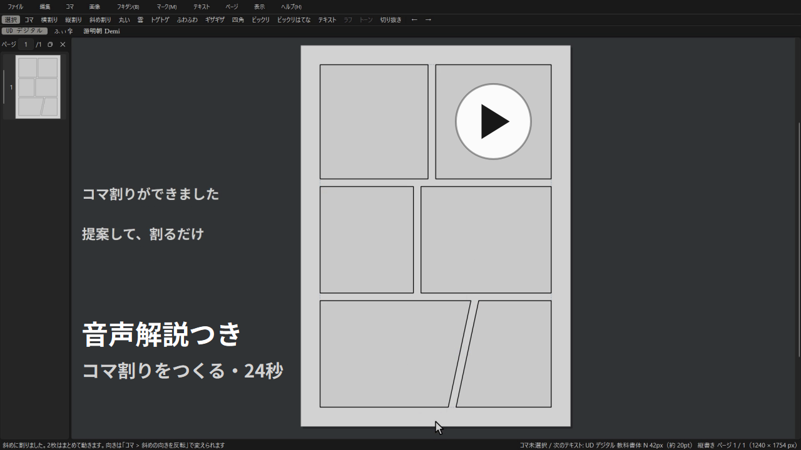
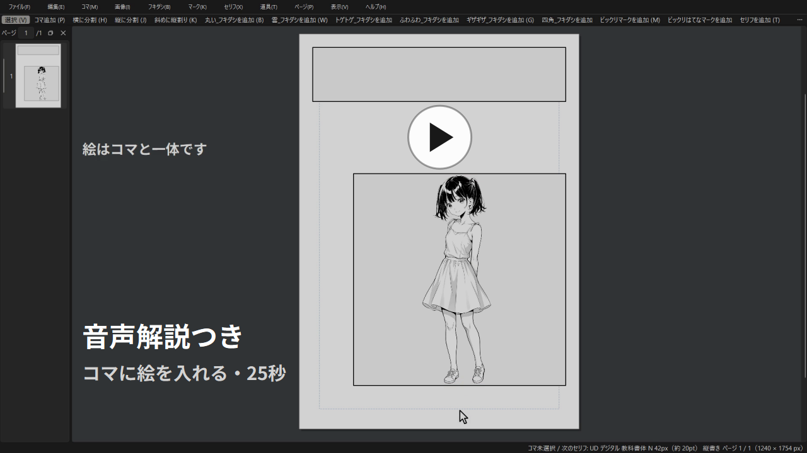
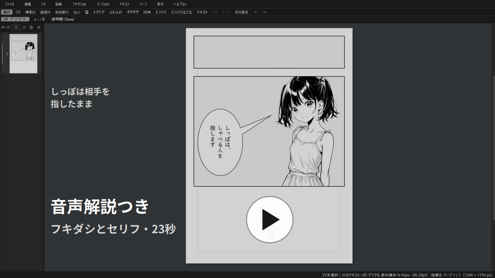

# MANGA_layout（漫画レイアウタ）

**ネーム／下書き専用の漫画エディタ（Windows）**  
ペイントソフトや生成AIで描いた絵を読み込み、コマ割り・フキダシ・テキストを置いて、
画像や PSD で書き出します。清書・仕上げはペイントソフト側で行う前提です。

- ウェブ漫画用で、印刷は考慮していません。単位はピクセル（px）です
- 描く道具（ブラシ・消しゴムなど）や色調補正はありません。トーンは、絵の黒ベタを
  斜線・灰色・白に置き換える形でだけ入れられます（→ 下記「黒ベタをトーンにする」）



---

## 入手する

**[Releases](../../releases) から最新版の zip をダウンロードし、好きな場所に展開してください。**

Releases に並んでいるものが、動作を確認済みの安定版です。ページ上部に見えているファイル一覧
（`main` ブランチ）は開発中の状態で、実験中の機能が入っていることがあります。**使う目的なら
Releases から取ってください。**

## はじめて使うとき

**先に Python 3.12 が入っている必要があります。** 入っていない場合は
[python.org](https://www.python.org/downloads/) から入れてください。

そのうえで `_setup_env.bat` をダブルクリックします。動かすのに必要なものが入ります。
**最初の1回だけ**で、2回目からは不要です（もう一度実行しても壊れません）。

Python が見つからないときは、`_setup_env.bat` が黒い画面にこう出して止まります。
そのまま閉じて、上のリンクから入れ直してください。

```
ERROR: could not create the venv. Python 3.12 may be missing.
```

## 起動する

`run.bat` をダブルクリックします。

好みの設定（最初に開くフォルダなど）を変えたいときは `settings.bat` です（→ 下記「設定ファイル」）。

---

## 使い方の流れ

右クリックで状況に応じたコマンドが出る仕組みです。  なので以下の操作方法は適当に読み飛ばし可
1. `N` で次のコマを提案させて置く（押すたびに別の案。気に入ったらコマをクリックで決定）。
   `J`（縦に割る）・`K`（斜めに割る）や右クリックの「ここで コマを横に割る」でコマ割りを作る
2. コマを選んで `Ctrl+V` で画像を貼る（`Ctrl+Shift+F` でコマいっぱいに広げる）
3. `B` / `W` / `G` でフキダシ、`T` でテキスト。用紙の上で押すとその場に置かれ、テキストはそのまま打てる
4. `Ctrl+Shift+N` でページを足し、`PageUp` / `PageDown` で行き来する
5. `Ctrl+S` で保存し、`Ctrl+E` で画像に書き出す
  
## あの機能がどこにあるか分からないとき

**メニューの ヘルプ → メニューを探す...**（`F1` または `Ctrl+F`）で、言葉を打ち込むと、
それを含む項目が**どのメニューの中にあるか**と一緒に並びます。

```
ファイル → ラフ → 読み込む...
　紙に描いたラフを、このページの一番下に敷く（書き出しには出ない）
```

- **項目の名前だけでなく、説明の文も探します。** 「backup」で「バックアップから復元...」が出ます
- **行を押すと、そのメニュー（この例なら「ファイル」）が画面の上端で四角く囲まれます。** 3秒で消えます
- **ここから実行はしません。** 最初に開く場所を指すだけなので、あとはメニューを開いてください
- **何も打たなければ全部並びます。** メニューの一覧としても使えます
- **フキダシは「吹き出し」「吹きだし」「ふきだし」でも出ます。** それ以外の言葉は打った通りに探すので、出てこなかったら言ってください（読み替えを足せます）

## キーを忘れたとき

**メニューの ヘルプ → ショートカットキーの一覧...**（`H`）で、キーでできる操作が
メニューごとに並びます。

**同じ内容を [docs/ショートカットキー一覧.md](docs/ショートカットキー一覧.md) にも
置いています。** アプリを開かずに読めます。下の「ショートカット」はよく使うものの
抜粋で、**全部載っているのはそちらです。**

```
■ テキスト
  F2         入力欄を開き直す...
  Ctrl+.     大きく
```

- **メニューに出ないキーとマウスの操作も、いちばん下に付きます。** `+` / `-`、スペース+ドラッグ、ホイールなど
- **出したままで押して試せます。** 窓を閉じなくても作品の側を操作できます
- **テキストを打っている間は、文字の入力が優先されます。** 打ち込んだキーが操作に化けることはありません

## 書き出す前に「抜けチェック」

**メニューの ファイル → 抜けチェック...** で、全ページの直し忘れを探します。
見つけて知らせるだけで、勝手には直しません。

探すのは、使えない画像・何も置いていないページ（ラフだけのページも含む）・
フキダシからはみ出したテキスト・空のままのテキスト・絵の入っていないコマ・
付箋の残っているページの6つです。**用紙からはみ出したコマは探しません**（断ち切りは普通の使い方なので）。

見つかったページには、ページ一覧のサムネイルの左上に**紫の印**が付きます（押すとそのページへ移れます）。
直したあとにもう一度「抜けチェック」を押すと、印が付け直されます。印は作品には保存されません。

## 黒ベタをトーンにする


**絵の黒く塗ってある所を、斜線のトーンに変えられます。** 元の画像は変わりません。

1. コマ（または中の絵）を選ぶ。絵が2枚以上あるコマは、ダブルクリックで絵を選ぶ
2. **右クリック → トーン → 入れる**（メニューの **画像 → トーン** からも同じものが出ます）

見た目は **斜線 / 灰色 / 白抜き** から選べます。濃さ・斜線の細かさ・向きも同じメニューで変えます。
調整の項目は、**効くまで何回でも重ねて押せます**。

| 困ったとき | 押す項目 |
|---|---|
| 黒ベタなのにトーンにならない | **`Shift`+`]`**（拾う黒を増やす）。連打しても、元に戻すは1回で済みます |
| 余計な所まで斜線になった | **`Shift`+`[`**（拾う黒を減らす）。それでも残るなら **トーン範囲を調整** で四角く囲う |
| 線画の線まで斜線になった | **細い線を残す** |

## 絵の一部を消す（切り抜き）

**背景だけ消す、人物だけ残す、といった切り抜きができます。** 元の画像は変わらず、
**切り抜きを外す** でいつでも戻せます。

1. メニューの **画像 → 切り抜き** を押す
2. 消したい所を**クリック**する。似た濃さの続く範囲が消えます。**`Shift`+クリックなら、そこだけ残す**
3. やめるときは、もう一度 **切り抜き** を押す

線で囲まれた絵が得意で、グラデーションで塗った絵は苦手です。
消えすぎ・足りないときは、同じメニューの **許容差を広く / 許容差を狭く** で合わせます。

## クリスタへレイヤーごと渡す（PSD で書き出し）

**`Ctrl+E` → 形式で `PSD` を選ぶと、1枚に潰さずレイヤーに分けて書き出します。**

| 上から | 中身 |
|---|---|
| テキスト | 文字。**クリスタでは打ち直しになります**（文字としては編集できません） |
| マーク | 「！」「!?」 |
| フキダシ | しっぽも含めて |
| **📁 コマ1** | コマ枠 / 集中線・流線 / **トーン・トーン範囲・白ベタ**（→ 下）/ 絵 |
| **📁 コマ2** | ↑ と同じ中身。コマの数だけ並びます |
| ラフ | **最初は非表示** |
| 用紙 | 白 |

- **コマは読む順**（上から下・右から左）に番号が振られます。`N`（次のコマを提案）が数える順とは
  違うことがありますが、番号はただの名前で、中身は入れ替わりません
- **「テキスト」のレイヤーは、v1.7 以前では「セリフ」という名前でした**
- **ファイルは重くなります**（1ページ 20MB 前後）

### クリスタのトーンを貼りたいとき（トーンは4枚に分かれています）

トーンを入れたコマは、**トーン・トーン範囲（最初は非表示）・白ベタ・絵**の4枚に分かれます。
貼り直す手順はこれだけです。

1. **トーン** のレイヤーを消す
2. **トーン範囲** から選択範囲を作る（「レイヤー」メニュー → 「選択範囲」）
3. そのまま好きなトーンを貼る

**白ベタがあるので、元の黒ベタが下から透けてきません。** 位置を合わせ直す必要もありません。

## 出力ファイルの場所： 
書き出した画像は**作品フォルダの中の `export` フォルダ**に入ります。形式（PNG / JPG / PSD）と
大きさ（117% / 100% / 75% / 50%）は書き出しの画面で選べます。既定は PNG の 100%（原寸）で、
ページの大きさそのままの画素数で出ます。クリスタの原稿に貼る下敷きをきめ細かくしたいときだけ
117% を選んでください。
PSD も同じ場所に、`p01.psd` のように拡張子だけ変えて入ります。

---

## 保存されるもの

作品は1個のファイルではなく、**フォルダ**として保存されます。中身は次の4つです。

| 名前 | 中身 |
|---|---|
| `project.json` | 作品そのもの。**開くときはこれを選ぶ** |
| `assets` | 貼り込んだ画像。名前は自動で付くので、手で触らない |
| `backup` | 自動で取られる控え。保存のたびに5世代、5分ごとに3世代 |
| `export` | 書き出した画像 |

調子が悪くなって前の状態に戻したいときは、**「ファイル」→「バックアップから復元...」**で、
`backup` に貯まった控えから1つ選びます。

- 選んでも `project.json` はまだ書き換わりません。**気に入らなければ `Ctrl+Z` で戻せます**
- 戻した状態を残すには、そのあと `Ctrl+S` で保存します
- 一覧には日時と、ページ数・コマ数が出ます（どの頃の作業かの手がかりになります）

---

## 設定ファイル

好みに合わせて変えられる項目は、**`data` フォルダの中の `settings.json`** にあります。

**`settings.bat` をダブルクリックすると、書き換えるための小さな窓が開きます。**
入れられない値はそもそも入力できず、フォルダは「選ぶ…」から選べるので、
下に書いた書き方（`\` を2つ重ねる、範囲を守る）を気にせずに済みます。
メモ帳などで直接開いて書き換えることもできます（どちらでも同じです）。

```json
{
  "format_version": 1,
  "default_parent_dir": "F:\\2025_e\\a漫画用\\帰省\\下書き",
  "autosave_interval_sec": 300,
  "jpg_quality": 90,
  "rough_opacity": 0.4,
  "favorite_fonts": ["UD デジタル 教科書体 N", "", ""]
}
```

| 項目 | 既定 | 入れられる値 | 何が変わるか |
|---|---|---|---|
| `default_parent_dir` | `null` | フォルダの場所 | 保存や画像選びの画面が最初に開く場所。作品フォルダそのものではなく、その**1つ上**を指定します |
| `autosave_interval_sec` | `300`（5分） | 5〜3600（秒） | 自動で控えを取る間隔。**変えたらアプリを開き直します** |
| `jpg_quality` | `90` | 1〜100 | JPG で書き出すときの画質（→ 下記） |
| `rough_opacity` | `0.4` | 0.05〜1.0 | ラフ（下敷き）の濃さ。小さいほど薄くなります |
| `favorite_fonts` | 既定の書体1つ | 書体名を3つまで | よく使う書体。道具箱のボタンと `F3` で切り替わります（→ 下記） |

メモ帳などで直接書き換えるときの注意（`settings.bat` の窓から変えるなら、どれも気にしなくて構いません）。

- **フォルダの場所は `\` を2つ重ねて書きます**（`F:\\2025_e\\...`）
- **書体名は1文字でも違うと、黙って別の書体で表示されます**（エラーは出ません）。`settings.bat` の窓から「選ぶ…」で選べば、この間違いは起きません
- 決められた範囲から外れた値を書いても、**元の値で普通に動きます**。書き間違いでアプリが開かなくなることはありません
- `autosave_interval_sec` 以外は、アプリを開いたまま書き換えてもすぐ効きます

**書き換えたのに効かないときは、`settings.bat` を開いてみてください。** 使えなかった値がある場合は、
その項目名が窓の上に出ます（ファイル全体が読めなくなっている場合も、その旨が出ます）。

### JPG の品質について

`jpg_quality` は 0〜100 で、大きいほど高画質・大容量になります。**100 にする意味はほとんどありません。**
品質ごとのデータ量の目安は次のとおりです（品質 100% のときを「1MB」とした場合）。

| 品質 | データ量 | 1MB のとき | 位置づけ |
|---|---|---|---|
| 95% | 約 50〜60% に減る | 約 550KB | 画質は 100% と**全く見分けがつかない**のに、データ量は一気に半分近くまで落ちます |
| 90%（既定） | 約 30〜40% に減る | 約 350KB | プロのカメラマンがウェブで公開する際によく使う、高画質と軽さを両立できる設定です |
| 80% | 約 20〜30% に減る | 約 250KB | 一般的なウェブサイトやブログで最も推奨される設定です。画質はきれいに保たれたまま、データ量は4分の1程度まで激減します |

**なぜ少し下げるだけでこんなに減るのか。**
JPG は「人間の目が気づきにくい細かい色の変化」から順番に、大雑把に間引いていく仕組みだからです。
品質 100% から 95% にするだけで、目には見えない不要なデータが大量に削ぎ落とされるため、
画質を落とさずにこれだけのデータ量を削減できます。

---

## ショートカット



**同じ手順を、音声の解説つきで見られます。**  
1本目が**コマ割りをつくる**（24秒）、2本目が**コマに絵を入れる**（25秒）、
3本目が**フキダシとセリフを置く**（23秒）。

<a href="https://youtu.be/yGQC8vJuG0Y"></a>
<a href="https://youtu.be/20XotHmBv9o"></a>
<a href="https://youtu.be/Zt7BHiHpTSs"></a>

### 道具の切り替え

| キー | 動作 |
|---|---|
| `V` / `P` | 選択 / コマ追加 |
| `J` / `K` | 縦に分割 / 斜めに縦割り。横に分割はメニューと右クリックから |
| `B` / `W` / `G` | フキダシ（丸い / 雲 / ギザギザ）。トゲトゲ・ふわふわ・四角はメニューと右クリックから |
| `T` / `M` | テキスト / ビックリマーク。ビックリはてなはメニューと右クリックから |

### コマ・画像

| キー | 動作 |
|---|---|
| ダブルクリック | コマに入って画像を選ぶ。**もう一度押すと、同じ場所の次のものへ**（下に隠れたコマや絵を選べます） |
| `Ctrl+V` | 画像を貼り付け |
| `Ctrl+Shift+F` | 画像をコマいっぱいに広げる |
| `Ctrl+Shift+A` | ページ全面にコマを作る |
| `N` | **次のコマを提案して置く。** 押すたびに次の案へ差し替わります（下記） |
| `Delete` | 選択中のコマ・画像を削除 |
| `Esc` | 画像からコマへ戻る／選択を解除 |
| `Shift`+ドラッグ | 縦横の比を保ったまま拡大縮小／15度ずつ回転（画像のつまみ） |

**`N`（次のコマを提案）について。** 描きかけのページを見て、次に置くコマの位置と
大きさを決めて置きます。**下見ではなく、実際に置きます。** 気に入らなければ
`N` をもう一度押すと次の案に差し替わり、`Ctrl+Z` を1回押せば消えます
（何回押しても、戻すのは1回です）。
コマが1つも無いページでも押せます。斜めのコマがあるページでは断ります。

### テキスト

| キー | 動作 |
|---|---|
| `F2` / `Enter` | 選択中のテキストの入力欄を開き直す |
| `Ctrl+B` | 太字にする |
| `F7` | 縦書き / 横書きを切り替える |
| `Ctrl+.` / `Ctrl+,` | 大きく / 小さく |
| `F3` | よく使う書体を順に切り替え（下記） |

**テキストを傾けたいときは「画像にする」。** テキストのメニューか右クリックから選ぶと、
そのテキストが**1枚の画像**（透明な背景に字が乗っただけのもの）になります。画像になると
**回せるようになり**、フキダシの外に置く小さな文字を斜めにできます。

- **文字としては打ち直せなくなります。** 直したいときは、消して打ち直してください
- **戻せるのは `Ctrl+Z` だけです。** アプリを閉じたあとは戻りません
- 焼いたあとの扱いはマークと同じです（丸いつまみをドラッグで回転、`Shift` で15度ずつ）
- **字が1つも入っていないテキストは画像にできません**（項目が押せません）

**よく使う書体（`F3`）について。** 書体は200件近く並ぶので、使う3つを登録しておくと、
一覧を開かずに切り替えられます。**登録は `settings.bat` の「よく使う書体」から。**
登録した書体は**画面上の道具箱にボタンとして並び**、今どれを使っているかが押し込みで分かります。
テキストを選んでいれば そのテキストの書体が、選んでいなければ**次に作るテキスト**の書体が変わります。

### トーン

| キー | 動作 |
|---|---|
| `Shift+]` / `Shift+[` | 拾う黒を増やす / 減らす（トーンの入った絵かコマを選んでいるとき） |
| `Shift+.` / `Shift+,` | 濃く / 薄くする（白抜きのときは効きません） |

### ページ

| キー | 動作 |
|---|---|
| `Ctrl+Shift+N` / `Ctrl+Shift+I` | ページを追加（末尾）/ 挿入（今のページの前） |
| `PageUp` / `PageDown` | 前後のページへ |
| `Ctrl+Shift+PageUp` / `Ctrl+Shift+PageDown` | 今のページを前後へ動かす（並べ替え） |

### 画面

| キー | 動作 |
|---|---|
| ホイール | 拡大縮小（マウスの位置が中心） |
| `+` / `-` | 拡大縮小（画面の中心が軸） |
| `Ctrl+1` / `Ctrl+0` | 原寸で表示 / ページ全体を表示 |
| スペース+ドラッグ／中ボタン+ドラッグ | 画面を動かす |
| 右クリック | 押した場所のものを選び、その場のメニューを出す |

### ファイル

| キー | 動作 |
|---|---|
| `Ctrl+S` / `Ctrl+Shift+S` | 保存 / 名前を付けて保存 |
| `Ctrl+N` / `Ctrl+O` / `Ctrl+W` | 新規作成 / 開く / 閉じる |
| `Ctrl+E` | 画像で書き出し（PNG / JPG / PSD） |
| `Ctrl+Z` / `Ctrl+Y`（`Ctrl+Shift+Z`） | 元に戻す / やり直す |

### 探す

| キー | 動作 |
|---|---|
| `F1` / `Ctrl+F` | メニューを探す（→ 上記「あの機能がどこにあるか分からないとき」） |
| `H` | ショートカットキーの一覧を出す |

### 全部の一覧

**上の表はよく使うものの抜粋です。** トーンの調整やマウスの操作も含めた全部は
[docs/ショートカットキー一覧.md](docs/ショートカットキー一覧.md) にあります。
**アプリのメニューから自動で作っている**ので、キーを変えても古くなりません。

---

## 仕様の詳細について

このリポジトリを読む AI・開発者は、**[要件定義.md](要件定義.md) を先に読むことを推奨します。**
機能の仕様と、なぜその形にしたかの経緯がすべてそこにあります。この README は使う人向けの説明で、
仕様の正となる文書ではありません。

**コードのどこに何があるかは [リポジトリの地図.md](リポジトリの地図.md) にあります。**
層の規則（中核は画面を呼ばない、など）と、各ファイルの役割、新しく足すときに触る場所を
まとめてあります。

---

## ライセンス

MIT ライセンスです（→ [LICENSE](LICENSE)）。**改変も再配布も自由**で、商用利用も構いません。
条件は「著作権表示とライセンス文を残すこと」だけです。無保証です。
