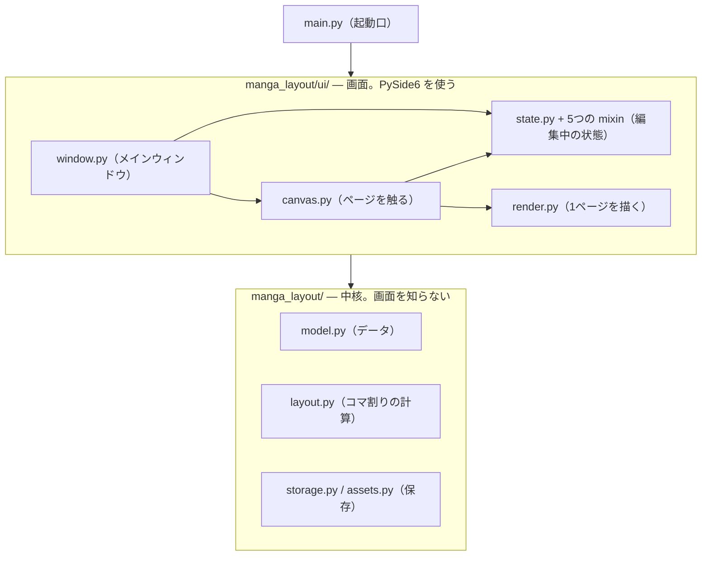

# リポジトリの地図

**どのファイルに何があり、新しく足すならどこか。** コードを初めて触るときと、
半年ぶりに戻ってきたときに、まずここを見る。

- **仕様（何を作るか・なぜその形か）は [要件定義.md](要件定義.md)。** ここには書かない
- **使い方は [README.md](README.md)。** あちらは使う人向け、ここは触る人向け
- **PySide6 の地雷は [PySide6の落とし穴.md](PySide6の落とし穴.md)**

**行数やクラス数は載せていない。** 編集のたびに古くなり、古くなったことに誰も
気づかないため。**代わりに、構造の規則と、それを確かめるコマンドを載せる**
（→ 末尾「この地図が古くなったら」）。

---

## 全体の形



## 層の規則は3つ

### 1. 中核は `ui/` を呼ばない

`manga_layout/` 直下から `ui/` を import しているファイルは**1つも無い**。
画面を差し替えても中核に影響が及ばず、テストが画面なしで動く土台がこれ。

```bash
grep -rn 'from .ui\|from manga_layout.ui' --include='*.py' manga_layout | grep -v '^manga_layout/ui/'
```

### 2. ただし「中核は Qt を知らない」ではない

**中核のうち5つだけが PySide6 を使う。** 画像の展開・マスク・自動領域選択・
PSD 書き出し・トーンの生成は、Qt の画像処理をそのまま使うほうが速く確実なため。

| Qt を使う中核 | 何のために |
|---|---|
| `images.py` | 画像の展開と、画面用の縮小版 |
| `image_masks.py` | 白黒マスクの読み書き |
| `wand.py` | 自動領域選択（塗りつぶし選択） |
| `tone.py` | 黒ベタをトーンへ置き換える |
| `psd.py` | PSD の書き出し |

**この5つは `manga_layout/__init__.py` から公開していない。** 公開すると
`import manga_layout` だけで PySide6 を引き込むことになる。使う側が
`from manga_layout.images import ...` と明示して取る。

**効いているかは、引き込まれたかどうかで数えられる。** `False` が正しい。

```bash
PYTHONUTF8=1 ./venv/Scripts/python.exe -c "import sys, manga_layout; print(any(m.startswith('PySide6') for m in sys.modules))"
```

```bash
grep -rlnE '^(from|import) PySide6' --include='*.py' manga_layout | grep -v '^manga_layout/ui/'
```

**`import` の行だけを数える。** ただ `PySide6` で探すと、注釈で名前を出している
だけの `model.py` と `__init__.py` まで並び、5つが7つに見える。

```bash
grep -rn 'PySide6' --include='*.py' manga_layout | grep -v '^manga_layout/ui/'   # ← これは多く出る
```

### 3. `ui/` の中の参照は一方向。逆流は型注釈に閉じ込める

`window.py` が一番上で、そこから下へ向かって呼ぶ。**下から `window` を呼び返す
5つのファイルは、型注釈のためだけに import している**（`if TYPE_CHECKING:` の中に
置いてあるので、実行時には読み込まれない）。

| 実行時には読み込まれない参照 | |
|---|---|
| `context_menu.py` / `menu_search.py` / `menus.py` / `project_io.py` / `shortcuts.py` | → `window` |

**この5つを `TYPE_CHECKING` の外へ出すと循環参照になる。** 型注釈を足すときに
うっかり出さないこと。

---

## 中核 — `manga_layout/`

### 形と座標

| ファイル | 役割 |
|---|---|
| `geometry.py` | ページ座標の図形。単位はピクセル（px、浮動小数） |
| `slant.py` | 斜め割りコマの計算 |
| `vertical.py` | 縦書きのセリフで、1文字ずつの置き場所を決める |
| `noise.py` | 形のばらつきに使う擬似乱数。**Qt もモデルも知らない** |

### データと保存

| ファイル | 役割 |
|---|---|
| `model.py` | プロジェクトのデータモデル |
| `validation.py` | `project.json` を読むときの型チェック |
| `storage.py` | `project.json` の読み書き |
| `assets.py` | 画像の実体を内容ハッシュで管理する |
| `export_io.py` | 書き出したファイルを、別名で書き切ってから置き換える |
| `errors.py` | このアプリが投げる例外 |
| `history.py` | Undo / Redo（要件定義 6.8） |
| `settings.py` | アプリの設定（`settings.json`） |
| `recent_project.py` | 直前に開いていた作品の場所 |
| `autosave_log.py` | 自動バックアップの記録 |

### コマ割りの計算

| ファイル | 役割 |
|---|---|
| `layout.py` | コマ割りの計算 |
| `next_panel.py` | ページと定石の橋渡し |
| `joseki.py` | 次のコマの位置を、定石と照合して提案する |

### 効果の形

| ファイル | 役割 |
|---|---|
| `focus.py` | 集中線の形を作る。**Qt も描画も知らない** |
| `flow.py` | 流線の形を作る。**Qt も描画も知らない** |

**`focus.py` と `flow.py` はよく似ているが、片方がもう片方を import していない。**
共有しているのは乱数だけで、線の形も長さの基準も別に持つ（楔形 ⇄ 紡錘形）。
**わざと分けてあるので、まとめない。**

### 画素を触る（Qt が要る → 上の規則2）

| ファイル | 役割 |
|---|---|
| `images.py` | 画像の展開と、画面用の縮小版の保持 |
| `image_masks.py` | 画像に掛ける白黒マスク |
| `wand.py` | 自動領域選択（塗りつぶし選択・マジックワンド） |
| `tone.py` | 画像の暗い部分をトーン（斜線・灰色・白）に置き換える |
| `psd.py` | PSD（Photoshop の保存形式）を書き出す |

### そのほか

| ファイル | 役割 |
|---|---|
| `check.py` | 点検（書き出す前の見回り） |
| `fetch.py` | ネット上の画像を取ってくる |
| `stickers/` | アプリに組み込んだマークの素材 |

---

## 画面 — `manga_layout/ui/`

### 編集中の状態（`ui/` の中で一番呼ばれている）

`EditorState` は**クラス1つだが、置き場所は6ファイルに分けてある**（mixin で
混ぜている）。**呼ぶ側から見える顔ぶれは1つのまま**なので、`state.EditorState` を
使えばよい。

| ファイル | 何の操作か |
|---|---|
| `state.py` | 土台（参照・選択と道具・1手の編集・複製・ページ・付箋）と、道具の定数 |
| `state_effects.py` | 集中線・流線・トーン |
| `state_image.py` | 絵の読み込み・切り抜き・ラフ |
| `state_text.py` | 吹き出し・マーク・セリフ |
| `state_panel.py` | 斜めのコマ・ロック・次の提案・重なり順 |
| `state_file.py` | 開く・保存・復元・点検の印 |

### 描く・触る

| ファイル | 役割 |
|---|---|
| `render.py` | 1ページぶんの絵を描く処理 |
| `canvas.py` | ページの表示と、コマの操作 |

**`render.py` は画面・PNG・PSD の3つから呼ばれる。** 「画面で見た通りに出力される」が
成り立つのはこのため（→ 要件定義 2章）。**描き方を変えると3つ全部に効く**ので、
片方だけ直したいときは分岐ではなく引数で分ける。

### 窓と、操作の入口

| ファイル | 役割 |
|---|---|
| `window.py` | メインウィンドウ。メニュー・道具箱・ページ送り・ファイル操作 |
| `menus.py` | メニューバーの各メニューの部品。**1ドメイン＝1クラス** |
| `context_menu.py` | 右クリックのメニューの組み立て |
| `shortcuts.py` | ショートカットキーの一覧を出す窓 |
| `menu_search.py` | メニューの項目を言葉で探す窓 |

### 小さい窓

| ファイル | 役割 |
|---|---|
| `pages.py` | ページ一覧（サムネイル）と、ページサイズの設定 |
| `check_view.py` | 点検の結果を出す窓 |
| `font_dialog.py` | フォントを選ぶ窓 |
| `restore.py` | 「バックアップから復元」の窓 |
| `saving.py` | 「名前を付けて保存」の窓 |

### 出す

| ファイル | 役割 |
|---|---|
| `project_io.py` | 作品のファイル入出力。新規・開く・保存・自動バックアップの段取り |
| `export.py` | PNG / JPG 書き出し |
| `psd_export.py` | ページを PSD のレイヤーへ分解する |
| `i18n.py` | Qt が用意しているボタン・窓の文字を日本語にする |

---

## どこに足すか

| 足したいもの | 触る場所 |
|---|---|
| **新しい種類のオブジェクト**（コマの上に置くもの） | **`model.py` の一覧コメントに手順がある**（`FloatingObject` の直前）。6ファイル・約15箇所 |
| コマや画像に付ける効果（集中線・流線の仲間） | 形は中核に新しいファイル、操作は `state_effects.py`、描画は `render.py`、つまみは `canvas.py`、項目は `menus.py` |
| **新しい道具**（道具箱に並ぶもの） | `state.py` の `TOOL_LABELS` と **`TOOL_SHORT_LABELS` の両方**、`window.py` の `_build_tool_actions`。**短い名前を足し忘れると起動時に落ちる**（→ 6.33。道具箱は横1列なので、メニューの名前をそのまま出すと入り切らない） |
| メニューの項目 | `menus.py` の該当クラス。**新しいドメインならクラスを1つ足し、`MainWindow.__init__` で `_menus` に登録する** |
| 右クリックの項目 | `context_menu.py` の `ContextMenu.build` |
| ショートカットキー | `window.py` の `_act` に渡す。一覧は `shortcuts.py` が自動で集める |
| 状態表示の文言 | 道具が名乗るものは `window.py` の `_tool_hint`、選択に応じるものは `_selection_hint` |
| 保存形式に載る項目 | `model.py` の `to_dict` / `from_dict` の対と、`validation.py`。**古い作品が開けなくなる変更は `format_version` を上げる** |
| コマ割りの計算 | `layout.py`。**Qt を import しないこと**（規則1） |

---

## リポジトリの直下

| 場所 | 中身 | git |
|---|---|---|
| `main.py` | 起動口。作品フォルダを渡すとそれを開く | ○ |
| `manga_layout/` | 本体 | ○ |
| `tests/` | テスト。**画面なし（offscreen）で動く** | ○ |
| `tools/` | 使い捨てに近い補助スクリプト（素材の取り込み、設定の編集など） | ○ |
| `samples/` | 見本の作品。`basic` は**保存形式 version 1 のまま**置いてあり、移行が効いていることの確認を兼ねる | ○（`assets/` などは除外） |
| `docs/` | README から参照する画像と、ショートカットキー一覧 | ○ |
| `data/` | 利用者のデータ。設定・自動保存の記録・検討メモ | **×** |
| `venv/` | Python の仮想環境 | **×** |

---

## 動かし方

```bash
./venv/Scripts/python.exe main.py
```

```bash
./venv/Scripts/python.exe -m pytest
```

**素の `python` を使わない。** 仮想環境は `_setup_env.bat` で作る（最初の1回だけ）。

---

## この地図が古くなったら

**役割の1行は、各ファイルの説明文の1行目をそのまま写したもの。** ずれたら、
説明文のほうが正。次のコマンドで一覧を出し直せる。

```bash
PYTHONUTF8=1 ./venv/Scripts/python.exe -c "import ast,pathlib;[print(p.as_posix(),'\t',(ast.get_docstring(ast.parse(p.read_text(encoding='utf-8'))) or '（説明文なし）').splitlines()[0]) for p in sorted(pathlib.Path('manga_layout').rglob('*.py'))]"
```

**層の規則3つは、上のそれぞれの節にある `grep` で確かめられる。**
規則が破れていれば出力に行が出る（規則1と2）か、`TYPE_CHECKING` の外に
`window` の import が出る（規則3）。

**ファイルが増えたのに、この地図に行が無い状態を見つける方法:**

```bash
comm -13 <(grep -o '`[a-z_0-9]*[.]py`' リポジトリの地図.md | tr -d '`' | sort -u) <(find manga_layout -name '*.py' -not -name '__init__.py' -exec basename {} ';' | sort -u)
```

**何も出なければ、全部の行がある。** `__init__.py` は役割の表に載せていないので
（公開する名前を決めるだけのファイル）、数える側から外してある。
